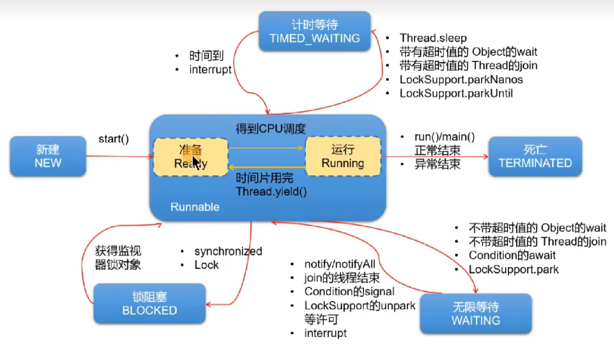

````
# 多线程

## 线程的创建

### 方式一：继承Thread类

- 创建一个继承于Thread类的子类
- 重写Thread的run() --->将此线程要执行的操作，声明在此方法体中
- 创建当前Thread子类的对象
- 通过对象调用start()

```java
new Thread(){
    public void run(){
        //operation
    }
}.start();
```

### 方式二：实现Runnable接口

- 创建一个实现Runnable接口的类
- 实现接口中的run() --> 将此线程要执行的操作，声明在此方法体中
- 创建当前实现类的对象
- 将此对象作为参数传递到Thread类的构造器中，创建Thread类的实现
- Thread类的实例调用start()：1.启动线程 2.调用当前线程的run()

```java
new Thread(new Runnable(){
    public void run(){
        //operation
    }
}).start();
```

## 注意事项

- 不能让已经start()的线程，再次执行start()，否则报异常
- 

## 常用方法

> 线程的构造器
> public Thread()：分配一个新的线程对象。
> public Thread(String name)：分配一个指定名字的新的线程对象。
> public Thread(Runnable target)：指定创建线程的目标对象，它实现了Runnable接口中的run方法
> public Thread(Runnable target,String name)：分配一个带有指定目标新的线程对象并指定名字。

> 常用方法
> start()：①调用线程②调用线程的run()
> currentThread()：获取当前线程
> getName()：获取当前线程的名称
> setName()：设置线程名
> sleep(long millis)：睡眠多少毫秒
> yield()：静态方法，一旦执行此方法，就释放CPU的执行权
> join()：在线程a中通过线程b调用join()，意味着线程a进入阻塞状态，直到线程b执行结束，线程a才结束阻塞状态，继续执行。
> isAlive()：判断当前线程是否存活

> 过时方法:
> stop():强行结束一个线程的执行，直接进入死亡状态。不建议使用
> void suspend() / void resume():可能造成死锁，所以也不建议使用

## 线程的优先级

> 线程调度策略
> 分时调度:所有线程`轮流使用`CPU 的使用权，并且平均分配每个线程占用CPU的时间。
> 抢占式调度:让`优先级高`的线程以`较大的概率`优先使用CPU。如果线程的优先级相同，那么会随机选择一个(线程随机性)

> MAX_PRIORITY：最大优先级 MIN_PRIORITY：最小优先级
> getPriority()：获取线程的优先级
> setPriority()：设置线程优先级

## 线程的生命周期




## 线程同步

> Java是如何解决线程的安全问题的？使用线程的同步机制

**方式一：同步代码块**

```java
synchronized(同步监视器){
    //需要被同步的代码
}
```

**说明**

- 需要被同步的代码，即为操作共享数据的代码。
- 共享数据：即多个线程多需要操作的数据。比如：ticket
- 需要被同步的代码，在被synchronized包裹以后，就使得一个线程在操作这些代码的过程中，其它线程必须等待。
- 同步监视器，俗称锁。哪个线程获取了锁，哪个线程就能执行需要被同步的代码。
- 同步监视器，可以使用任何一个类的对象充当。但是，多个线程必须共用同一个同步监视器。

**注意**

- 在实现Runnable接口的方式中，同步监视器可以考虑使用：this。
- 在继承Thread类的方式中，同步监视器要慎用this,可以考虑使用：当前类.class。

---

**方式二：同步方法**

> 定义：如果操作共享数据的代码完整的声明在了一个方法中，那么我们就可以将此方法声明为同步方法即可
> 非静态的同步方法，默认同步监视器是**this**
> 静态的同步方法，默认同步监视器是**当前类本身**。

> synchronized好处：解决了线程的安全问题。
> 弊端：在操作共享数据时，多线程其实是串行执行的，意味着性能低。

## 死锁


诱发死锁的原因：

- 互斥条件 
- 占用且等待 
- 不可抢夺（或不可抢占）
- 循环等待

以上4个条件，同时出现就会触发死锁。
解决死锁：

- 死锁一旦出现，基本很难人为干预，只能尽量规避。可以考虑打破上面的诱发条件。
- 针对条件1：互斥条件基本上无法被破坏。因为线程需要通过互斥解决安全问题。
- 针对条件2：可以考虑一次性申请所有所需的资源，这样就不存在等待的问题：
- 针对条件3：占用部分资源的线程在进一步申请其他资源时，如果申请不到，就主动释放掉已经占用的资源。
- 针对条件4：可以将资源改为线性顺序。申请资源时，先申请序号较小的，这样避免循环等待问题。

## Lock

> 除了使用synchronized同步机制处理线程安全问题之外，还可以使用jdk5.0提供的Lock锁的方式

Lock锁实现步骤：
步骤1.创建Lock的实例，需要确保多个线程共用同一个Lock实例！需要考虑将此对象声明为static final
步骤2.执行Lock()方法，锁定对共享资源的调用
步骤3.unlock()的调用，释放对共享数据的锁定

## 线程的通信

1.线程间通信的理解
当我们`需要多个线程`来共同完成一件任务，并且我们希望他们有规律的执行，那么多线程之间需要一些通信机制，可以协调它们的工作，以此实现多线程共同操作一份数据。
2.涉及到三个方法的使用：

- wait():线程一旦执行此方法，就进入等待状态。同时，会释放对同步监视器的调用
- notify():一旦执行此方法，就会唤醒被wait()的线程中优先级最高的那一个线程。（如果被wait()的多个线程的优先级相同则会随机唤醒一个)。被唤醒的线程从当初被wait的位置继续执行。
- notifyAll():一旦执行此方法，就会唤醒所有被wait的线程。

3.注意点：

- 此三个方法的使用，必须是在同步代码块或同步方法中。
  (超钢：Lock需要配合Condition实现线程间的通信)
- 此三个方法的调用者，必须是同步监视器，否则报异常：`IllegalMonitorStateException`
- 此三个方法声明在Object类中

## 线程安全的单例模式

```java
public final class Singleton{
	private singleton(){}
	//问题1：解释为什么要加volatile?
	private static volatile Singleton INSTANCE =  null;
	//问题2：对比实现3，说出这样做的意义
	public static Singleton getInstance(){
	if (INSTANCE !null){
		return INSTANCE;
    }
	synchronized (Singleton.class){
	//问题3：为什么还要在这里加为空判断，之前不是判断过了吗
	if (INSTANCE !null){
		return INSTANCE;
    }
	INSTANCE = new Singleton();
	return INSTANCE;
}
```


````

