# 第14章_MySQL事务日志


事务有4种特性：原子性、一致性、隔离性和持久性。那么事务的四种特性到底是基于什么机制实现呢？

- 事务的隔离性由 `锁机制` 实现。
- 而事务的原子性、一致性和持久性由事务的 redo 日志和undo 日志来保证。
  - REDO LOG 称为 `重做日志` ，提供再写入操作，恢复提交事务修改的页操作，用来保证事务的持久性。
  - UNDO LOG 称为 `回滚日志` ，回滚行记录到某个特定版本，用来保证事务的原子性、一致性。

有的DBA或许会认为 UNDO 是 REDO 的逆过程，其实不然。REDO和UNDO都可以视为是一种`恢复操作`

- redo log:是存储引擎层(innodb)生成的日志，记录的是"`物理级别`"上的页修改操作，比如页号xx、偏移量ywy写入了'zzz'数据。主要为了保证数据的可靠性;

  > 提交，由redo log来保证事务的持久化。

- undo log:是存储引擎层(innodb)生成的日志，记录的是`逻辑操作`日志，比如对某一行数据进行了INSERT语句操作，那么undo log就记录一条与之相反的DELETE操作。主要用于`事务的回滚`(undo log 记录的是每个修改操作的`逆操作`)和`一致性非锁定读`(undo log回滚行记录到某种特定的版本---MVCC，即多版本并发控制)。

## 1. redo日志

InnoDB存储引擎是以`页为单位`来管理存储空间的。在真正访问页面之前需要把在`磁盘上`的页缓存到内存中的
`Buffer Pool`之后才可以访问。所有的变更都必须`先更新缓冲池中`的数据，然后缓冲池中的`脏页`会以一定的频率被刷入磁盘（ `checkPoint`机制），通过缓冲池来优化CPU和磁盘之间的鸿沟，这样就可以保证整体的性能不会下降太快。

### 1.1 为什么需要REDO日志

一方面，缓冲池可以帮助我们消除CPU和磁盘之间的鸿沟，checkpoint机制可以保证数据的最终落盘，然而由于checkpoint `并不是每次变更的时候就触发` 的，而是master线程隔一段时间去处理的。所以最坏的情况就是事务提交后，刚写完缓冲池，数据库宕机了，那么这段数据就是丢失的，无法恢复。

另一方面，事务包含 `持久性` 的特性，就是说对于一个已经提交的事务，在事务提交后即使系统发生了崩溃，这个事务对数据库中所做的更改也不能丢失。

那么如何保证这个持久性呢？ `一个简单的做法` ：在事务提交完成之前把该事务所修改的所有页面都刷新到磁盘，但是这个简单粗暴的做法有些问题:

- **修改量与刷新磁盘工作量严重不成比例**

  有时候我们仅仅修改了某个页面中的一个字节，但是我们知道在InnoDB中是以页为单位来进行磁盘lo的，也就是说我们在该事务提交时不得不将一个完整的页面从内存中刷新到磁盘，我们又知道一个页面默认是16KB大小，只修改一个字节就要刷新16KB的数据到磁盘上显然是太小题大做了。

- 随机lo刷新较慢

  一个事务可能包含很多语句，即使是一条语句也可能修改许多页面，假如该事务修改的这些页面可能并不相邻，这就意味着在将某个事务修改的Buffer Pool中的页面`刷新到磁盘`时需要进行很多的`随机IO`，随机Io比顺序IO要慢，尤其对于传统的机械硬盘来说。


`另一个解决的思路` ：我们只是想让已经提交了的事务对数据库中数据所做的修改永久生效，即使后来系统崩溃，在重启后也能把这种修改恢复出来。所以我们其实没有必要在每次事务提交时就把该事务在内存中修改过的全部页面刷新到磁盘，只需要把 `修改` 了哪些东西 `记录一下` 就好。比如，某个事务将系统表空间中 `第10号` 页面中偏移量为 `100` 处的那个字节的值 `1` 改成 `2` 。我们只需要记录一下：将第0号表空间的10号页面的偏移量为100处的值更新为 2 。  

InnoDB引擎的事务采用了WAL技术(`Write-Ahead Logging` )，这种技术的思想就是先写日志，再写磁盘，只有日志写入成功，才算事务提交成功，这里的日志就是redo log。当发生宕机且数据未刷到磁盘的时候，可以通过redo log来恢复，保证ACID中的D，这就是redo log的作用。

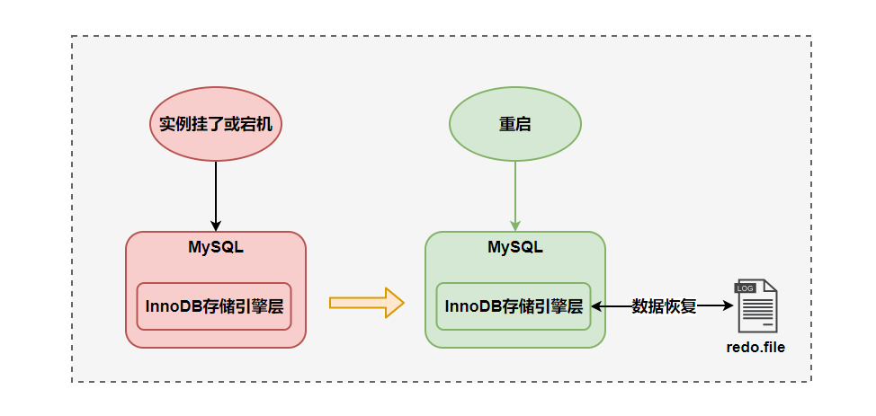

### 1.2 REDO日志的好处、特点

**1. 好处**

- **redo日志降低了刷盘频率**
- https://www.bilibili.com/video/BV1iq4y1u7vj?p=169&t=1220.2存储表空间ID、页号、偏移量以及需要更新的值，所需的存储空间是很小的，刷盘快。

**2. 特点**

- **redo日志是顺序写入磁盘的**

  在执行事务的过程中，每执行一条语句，就可能产生若干条redo日志，这些日志是按照产生的`顺序写入磁盘`的，也就是使用顺序Io，效率比随机Io快。

- **事务执行过程中，redo log不断记录**

  redo log跟bin log的区别，redo log是`存储引擎层`产生的，而bin log是`数据阵层`广生的。假设一个事务，对表做10万行的记录插入，在这个过程中，一直不断的往redo log顺序记录，而bin log不会记录，直到这个事务提交，才会一次写入到bin log文件中。

### 1.3 redo的组成

Redo log可以简单分为以下两个部分：

- `重做日志的缓冲 (redo log buffer)` ，保存在内存中，是易失的。

  在服务器启动时就向操作系统申请了一大片称之为redo log buffer的`连续内存`空间，翻译成中文就是redo日志缓冲区。这片内存空间被划分成若干个连续的`redo log block`。一个redo log block占用`512字节`大小。

  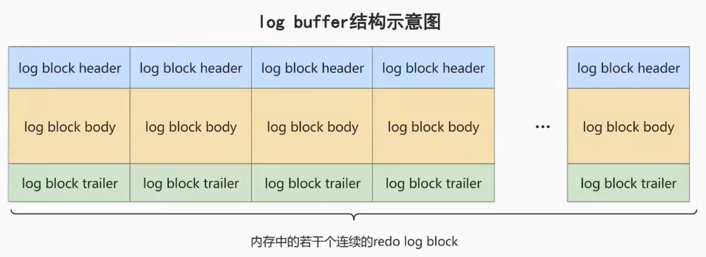

  **参数设置：innodb_log_buffer_size：**

  redo log buffer 大小，默认 `16M` ，最大值是4096M，最小值为1M。  

 ```sql
mysql> show variables like '%innodb_log_buffer_size%';
+------------------------+----------+
| Variable_name | Value |
+------------------------+----------+
| innodb_log_buffer_size | 16777216 |
+------------------------+----------+
```

- `重做日志文件(redologfile)`，保存在硬盘中，是持久的。

  REDO日志文件如图所示，其中的`ib_logfile0`和`ib_logfile1`即为redo log日志。

  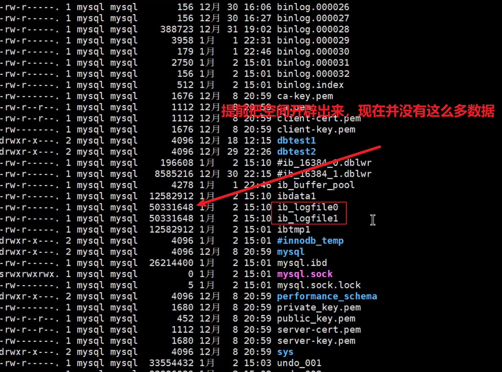

### 1.4 redo的整体流程

以一个更新事务为例，redo log 流转过程，如下图所示：  


```
第1步：先将原始数据从磁盘中读入内存中来，修改数据的内存拷贝
第2步：生成一条重做日志并写入redo log buffer，记录的是数据被修改后的值
第3步：当事务commit时，将redo log buffer中的内容刷新到 redo log file，对 redo log file采用追加写的方式
第4步：定期将内存中修改的数据刷新到磁盘中  
```

> 体会：
>
> Write-Ahead Log(预先日志持久化)：在持久化一个数据页之前，先将内存中相应的日志页持久化。  

### 1.5 redo log的刷盘策略

redo log的写入并不是直接写入磁盘的，InnoDB引擎会在写redo log的时候先写redo log buffer，之后以 `一定的频率 刷`入到真正的redo log file 中。这里的一定频率怎么看待呢？这就是我们要说的刷盘策略。  


注意，redo log buffer刷盘到redo log file的过程并不是真正的刷到磁盘中去，只是刷入到 `文件系统缓存`（page cache）中去（这是现代操作系统为了提高文件写入效率做的一个优化），真正的写入会交给系统自己来决定（比如page cache足够大了）。那么对于InnoDB来说就存在一个问题，如果交给系统来同步，同样如果系统宕机，那么数据也丢失了（虽然整个系统宕机的概率还是比较小的）。

针对这种情况，InnoDB给出 `innodb_flush_log_at_trx_commit` 参数，该参数控制 commit提交事务时，如何将 redo log buffer 中的日志刷新到 redo log file 中。它支持三种策略：

- `设置为0` ：表示每次事务提交时不进行刷盘操作。（系统默认master thread每隔1s进行一次重做日志的同步）  

- `设置为1` ：表示每次事务提交时都将进行同步，刷盘操作（ `默认值` ）

- `设置为2` ：表示每次事务提交时都只把 redo log buffer 内容写入 `page cache`，不进行同步。由os自己决定什么时候同步到磁盘文件。  

  ```sql
  show variables like 'innodb_flush_log_at_trx_commit';
  
  mysql> show variables like 'innodb_flush_log_at_trx_commit';
  +--------------------------------+-------+
  | Variable_name                  | Value |
  +--------------------------------+-------+
  | innodb_flush_log_at_trx_commit | 1     |
  +--------------------------------+-------+
  1 row in set (0.00 sec)
  
  ```

  

另外，InnoDB存储引擎有一个后台线程，每隔1秒，就会把`redo log buffer中`的内容写到文件系统缓存( `page cache` )，然后调用刷盘操作。

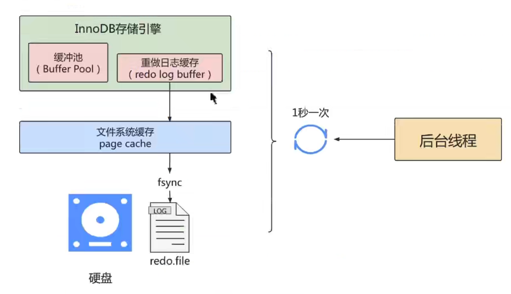

也就是说，一个没有提交事务的`redo log`记录，也可能会刷盘。因为在事务执行过程redo log记录是会写入`redo log buffer` 中，这些redo log记录会被`后台线程`刷盘。


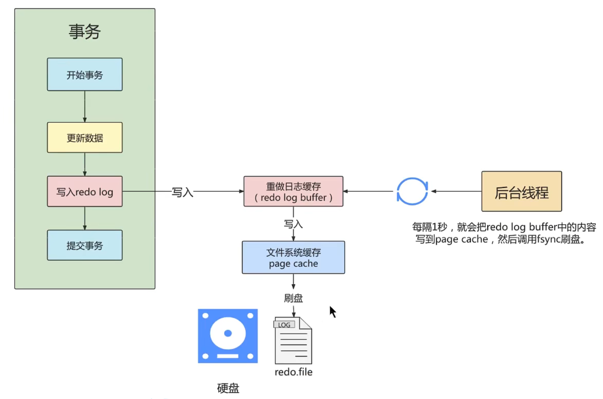


除了后台线程每秒`1次`的轮询操作，还有一种情况，当`redo log buffer`占用的空间即将达到`innodb_log_buffer_size`(这个参数默认是16M)的一半的时候，后台线程会主动刷盘。

### 1.6 不同刷盘策略演示

1.流程图  

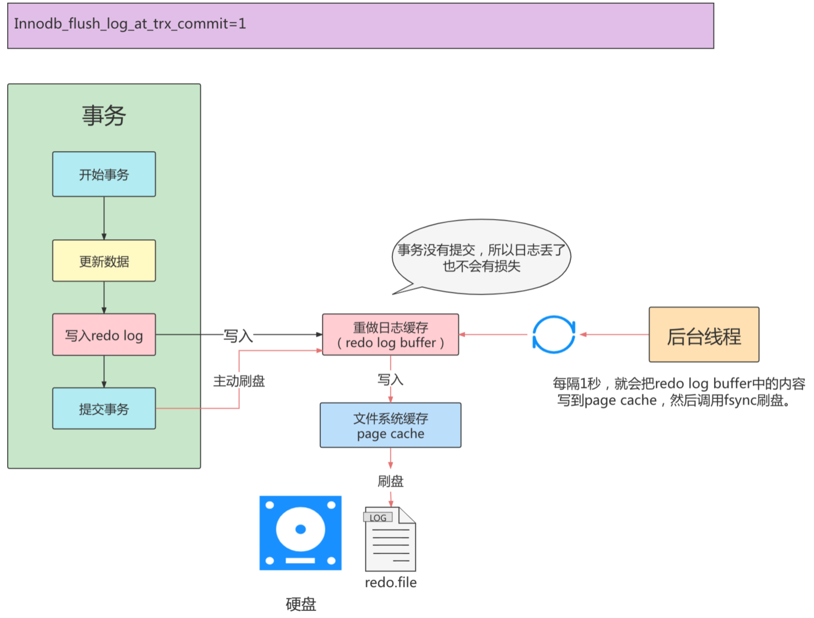

除了1秒刷盘，提交了也刷盘。效率差一些。

> 小结:  innodb_flush_log_at_trx_commit=1
>
> 为1时，只要事务提交成功,redo log记录就一定在硬盘里，**不会有任何数据丢失。**
>
> 如果事务执行期间MySQL挂了或宕机，这部分日志丢了，但是事务并没有提交，所以日志丢了也不会有损失。可以保证ACID的D，数据绝对不会丢失，但是效率最差的。
>
> 建议使用默认值，虽然操作系统宕机的概率理论小于数据库宕机的概率，但是一般既然使用了事务，那么数据的安全相对来说更重要些。|


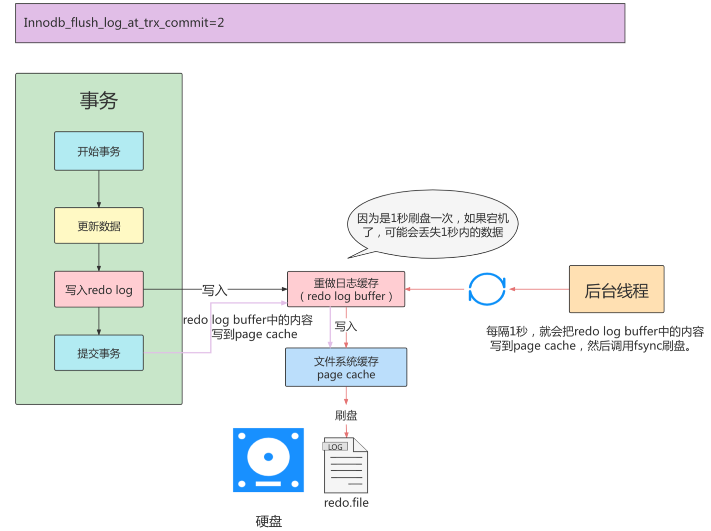

除了1s 强制刷盘，，page cache 由系统决定啥时候刷盘

> 小结: innodb_flush_log_at_trx_commit=2
>
> 为2时，只要事务提交成功,`redo log buffer`中的内容只写入文件系统缓存（ page cache ) 。
>
> 如果仅仅只是`MySQL`挂了不会有任何数据丢失，但是操作系统宕机可能会有`1`秒数据的丢失，这种情况下无法满足ACID中的D。但是数值2肯定是效率最高的。

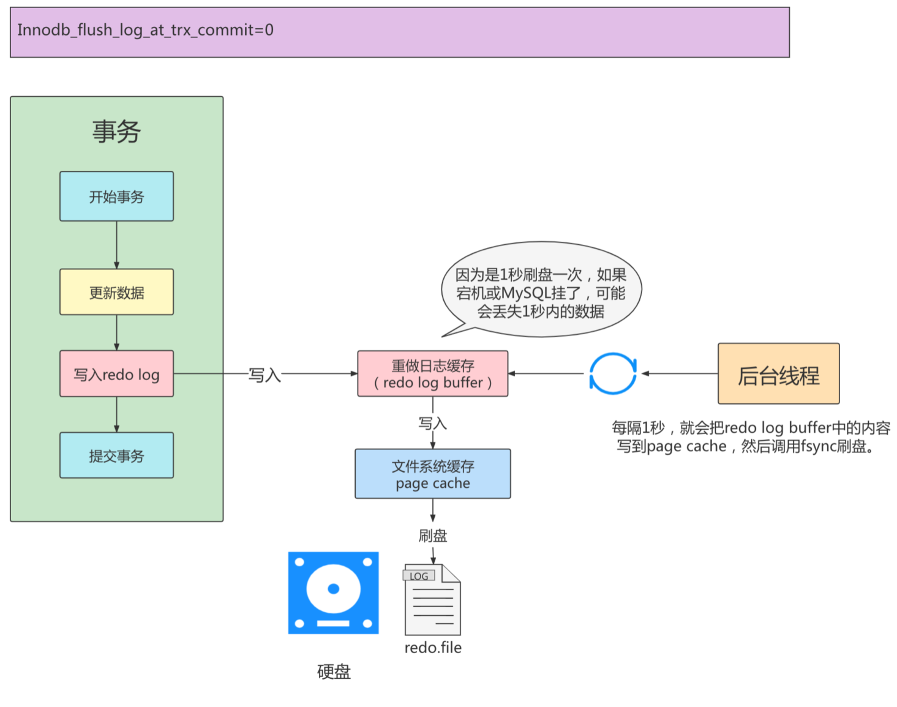


2.举例


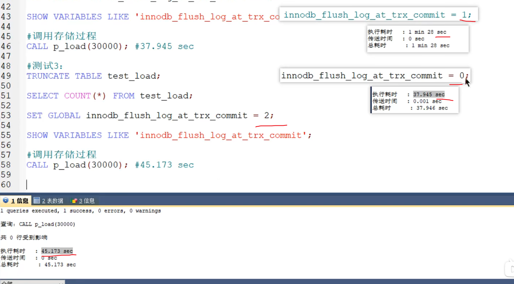


可以看到：

- 1最慢 但最安全

- 0 最快最不安全
- 2 折中。

### 1.7 写入redo log buffer 过程

**1.补充概念：Mini-Transaction**

MySQL把对底层页面中的一次原子访问的过程称之为一个`Mini-Transaction`，简称`mtr`，比如，向某个索引对应的B+树中插入一条记录的过程就是一个`Mini-Transaction`。一个所谓的`mtr`可以包含一组redo日志，在进行崩溃恢复时这一组`redo`日志作为一个不可分割的整体。

一个事务可以包含若干条语句，每一条语句其实是由若干个 `mtr` 组成，每一个 `mtr` 又可以包含若干条redo日志，画个图表示它们的关系就是这样：  

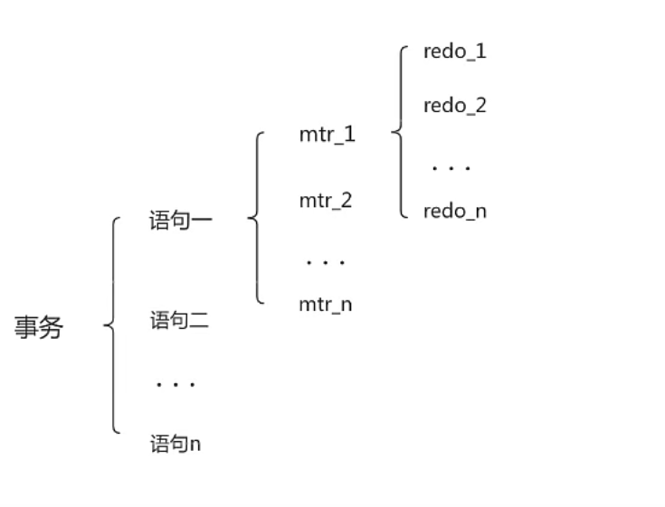

**2.redo 日志写入log buffer**  

向`log buffer`中写入redo日志的过程是顺序的，也就是先往前边的block中写，当该block的空闲空间用完之后再往下一个block中写。当我们想往`log buffer`中写入redo日志时，第一个遇到的问题就是应该写在哪个`block`的哪个偏移量处，所以`InnoDB`的设计者特意提供了一个称之为`buf_free`的全局变量，该变量指明后续写入的redo日志应该写入到`log buffer`中的哪个位置，如图所示:

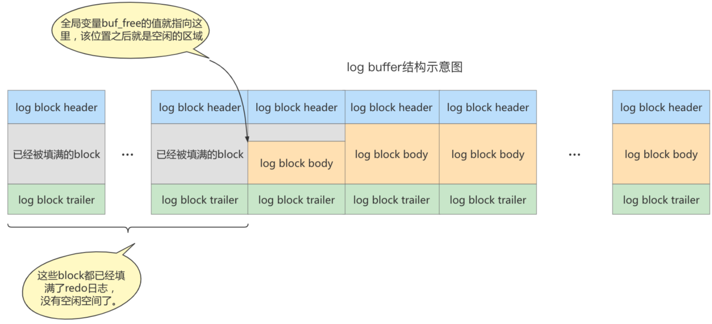

一个mtr执行过程中可能产生若干条redo日志，`这些redo日志是一个不可分割的组`，所以其实并不是每生成一条redo日志，就将其插入到log buffer中，而是每个mtr运行过程中产生的日志先暂时存到一个地方，当该mtr结束的时候，将过程中产生的一组redo日志再全部复制到log buffer中。我们现在假设有两个名为`T1`、`T2`的事务，每个事务都包含2个mtr，我们给这几个mtr命名一下:

- 事务`T1`的两个`mtr`分别称为`mtr_T1_1`和`mtr_T1_2`。
- 事务`T2`的两个`mtr`分别称为`mtr_T2_1`和`mtr_T2_2`。

每个mtr都会产生一组redo日志，用示意图来描述一下这些mtr产生的日志情况：  

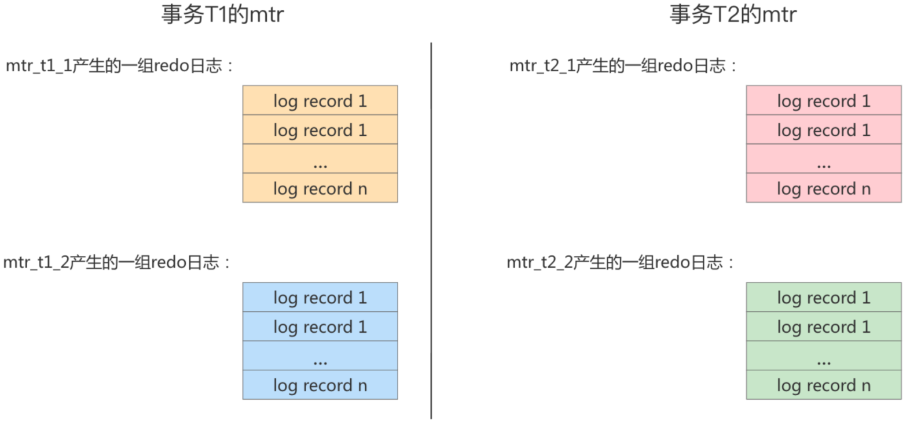

不同的事务可能是 `并发` 执行的，所以 `T1` 、 `T2` 之间的 `mtr` 可能是 `交替执行` 的。每当一个mtr执行完成时，伴随该mtr生成的一组redo日志就需要被复制到log buffer中，也就是说不同事务的mtr可能是交替写入log buffer的，我们画个示意图(为了美观，我们把一个mtr中产生的所有的redo日志当作一个整体来画):

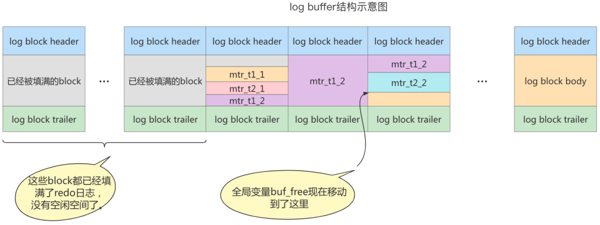

**3. redo log block的结构图**  

一个redo log block是由`日志头`、`日志体`、`日志尾`组成。日志头占用12字节，日志尾占用8字节，所以一个block真正能存储的数据就是512-12-8=492字节。


> **为什么一个block设计成512字节?**
>
> 这个和磁盘的扇区有关，机械磁盘默认的扇区就是512字节，如果你要写入的数据大于512字节，那么要写入的扇区肯定不止一个，这时就要涉及到盘片的转动，找到下一个扇区，假设现在需要写入两个扇区A和B，如果扇区A写入成功，而扇区B写入失败，那么就会出现`非原子性`的写入，而如果每次只写入和扇区的大小一样的512字节，那么每次的写入都是原子性的。

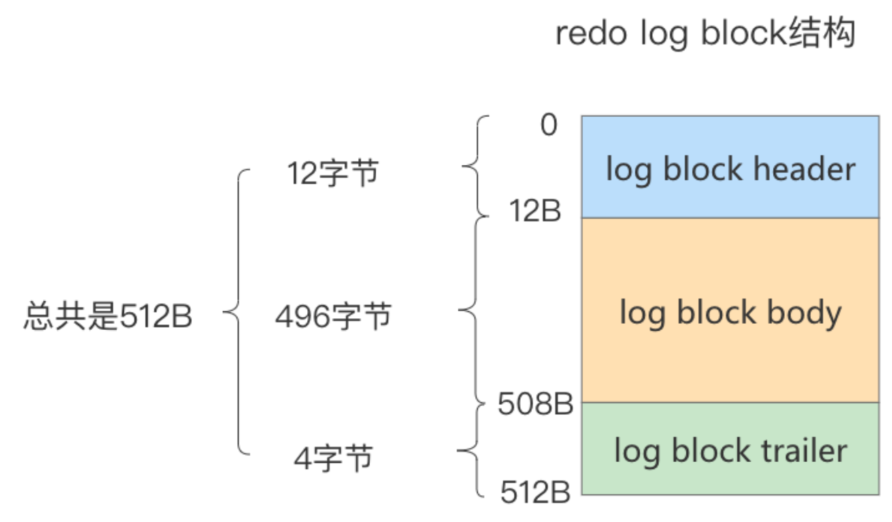


真正的redo日志都是存储到占用`496`字节大小的`log block body`中，图中的`log block header`和`logblock trailer`存储的是一些管理信息。我们来看看这些所谓的`管理信息`都有什么。


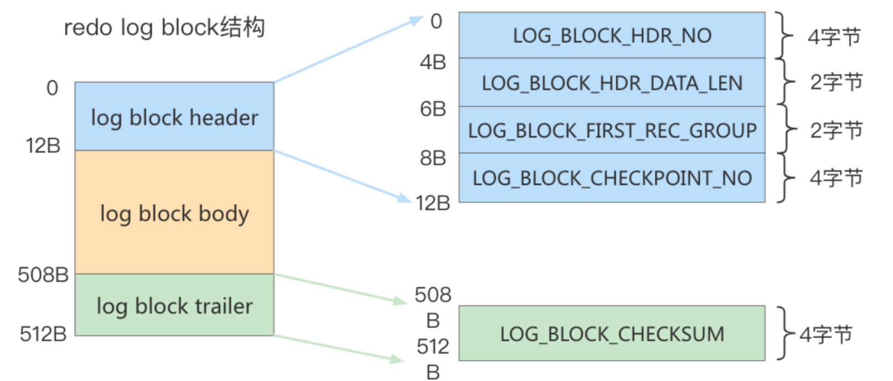

....具体字段，暂时不学了。

### 1.8 redo log file

#### 1. 相关参数设置

- `innodb_log_group_home_dir` ：指定 redo log 文件组所在的路径，默认值为 `./` ，表示在数据库的数据目录下。MySQL的默认数据目录（ `var/lib/mysql` ）下默认有两个名为 `ib_logfile0` 和`ib_logfile1` 的文件，log buffer中的日志默认情况下就是刷新到这两个磁盘文件中。此redo日志文件位置还可以修改。

- `innodb_log_files_in_group`：指明redo log file的个数，命名方式如：ib_logfile0，iblogfile1...iblogfilen。默认2个，最大100个。  

  ```sql
  mysql> show variables like 'innodb_log_files_in_group';
  +---------------------------+-------+
  | Variable_name | Value |
  +---------------------------+-------+
  | innodb_log_files_in_group | 2 |
  +---------------------------+-------+
  #ib_logfile0
  #ib_logfile1
  ```


- **innodb_flush_log_at_trx_commit**：控制 redo log 刷新到磁盘的策略，默认为1。

- **innodb_log_file_size**：单个 redo log 文件设置大小，默认值为 `48M` 。最大值为512G，注意最大值指的是整个 redo log 系列文件之和，即（innodb_log_files_in_group * innodb_log_file_size ）不能大于最大值512G。  

  ```sql
  mysql> show variables like 'innodb_log_file_size';
  +----------------------+----------+
  | Variable_name | Value |
  +----------------------+----------+
  | innodb_log_file_size | 50331648 |
  +----------------------+----------+
  ```

  根据业务修改其大小，以便容纳较大的事务。编辑my.cnf文件并重启数据库生效，如下所示  

  ```sql
  [root@localhost ~]# vim /etc/my.cnf
  innodb_log_file_size=200M  
  
  ```

  

  > 在数据库实例更新比较频繁的情况下，可以适当加大 redo log组数和大小。但也不推荐redo log 设置过大，在MySQL崩溃恢复时会重新执行REDO日志中的记录。

#### 2. 日志文件组  

从上边的描述中可以看到，磁盘上的`redo`日志文件不只一个，而是以一个`日志文件组`的形式出现的。这些文件以`ib_logfile[数字]`（`数字`可以是0、1、2...）的形式进行命名，每个的redo日志文件大小都是一样的。

在将redo日志写入日志文件组时，是从`ib_logfile0`开始写，如果`ib_logfile0`写满了，就接着`ib_logfile1`写。同理,`ib_logfile1`.写满了就去写`ib_logfile2`，依此类推。如果写到最后一个文件该咋办?那就重新转到`ib_logfile0`继续写，所以整个过程如下图所示:


总共的redo日志文件大小其实就是： `innodb_log_file_size × innodb_log_files_in_group` 。

采用循环使用的方式向redo日志文件组里写数据的话，会导致后写入的redo日志覆盖掉前边写的redo日志？当然！所以InnoDB的设计者提出了checkpoint的概念。

#### 3. checkpoint  

在整个日志文件组中还有两个重要的属性，分别是write pos、checkpoint

- `write pos`是当前记录的位置，一边写一边后移
-  `checkpoint`是当前要擦除的位置，也是往后推移

每次刷盘redo log记录到日志文件组中，write pos位置就会后移更新。每次MySQL加载日志文件组恢复数据时，会清空加载过的redo log记录，并把 checkpoint后移更新。write pos和checkpoint之间的还空着的部分可以用来写入新的redo log记录。


如果 write pos 追上 checkpoint ，表示**日志文件组**满了，这时候不能再写入新的 redo log记录，MySQL 得停下来，清空一些记录，把 checkpoint 推进一下。  


### 1.9 redo log小结

相信大家都知道redo log的作用和它的刷盘时机、存储形式:

**InnoDB的更新操作采用的是Write Ahead Log(预先日志持久化)策略，即先写日志，再写入磁盘。**


## 2. Undo日志

redo log是事务持久性的保证，undo log是事务原子性的保证。在事务中 `更新数据` 的 `前置操作` 其实是要
先写入一个 `undo log` 。

### 2.1 如何理解Undo日志

事务需要保证 `原子性` ，也就是事务中的操作要么全部完成，要么什么也不做。但有时候事务执行到一半会出现一些情况，比如：

- 情况一：事务执行过程中可能遇到各种错误，比如 `服务器本身的错误` ， `操作系统错误` ，甚至是突然 `断电` 导的错误。
- 情况二：程序员可以在事务执行过程中手动输入 `ROLLBACK` 语句结束当前事务的执行。

以上情况出现，我们需要把数据改回原先的样子，这个过程称之为 `回滚` ，这样就可以造成一个假象：这个事务看起来什么都没做，所以符合 `原子性` 要求。

每当我们要对一条记录做改动时(这里的`改动`可以指`INSERT`、`DELETE`、`UPDATE`)，都需要"留一手"——把回
滚时所需的东西记下来。比如:

- 你`插入一条记录时`，至少要把这条记录的主键值记下来，之后回滚的时候只需要把这个主键值对应的`记录删掉`就好了。(对于每个INSERT, InnoDB存储引擎会完成一个DELETE)

- 你`删除了一条记录`，至少要把这条记录中的内容都记下来，这样之后回滚时再把由这些内容组成的记录插入到表中就好了。(对于每个DELETE,InnoDB存储引擎会执行一个INSERT)
- 你`修改了一条记录`，至少要把修改这条记录前的旧值都记录下来，这样之后回滚时再把这条记录`更新为旧值`就好了。(对于每个UPDATE，InnoDB存储引擎会执行一个相反的UPDATE，将修改前的行放回去)

MySQL把这些为了回滚而记录的这些内容称之为`撤销日志`或者`回滚日志(`即`undo log`)。注意，由于查询操作( `SELECT`）并不会修改任何用户记录，所以在杳询操作行时，并不需要记录相应的undo日志

此外，undo log 会产生`redo log`，也就是undo log的产生会伴随着redo log的产生，这是因为undo log也需要持久性的保护


### 2.2 Undo日志的作用

- **作用1：回滚数据**

   用户对undo日志可能`有误解`: undo用于将数据库物理地恢复到执行语句或事务之前的样子。但事实并非如此。undo是`逻辑日志`，因此只是将数据库逻辑地恢复到原来的样子。所有修改都被逻辑地取消了，但是数据结构和页本身在回滚之后可能大不相同。

  这是因为在多用户并发系统中，可能会有数十、数百甚至数千个并发事务。数据库的主要任务就是协调对数据记录的并发访问。比如，一个事务在修改当前一个页中某几条记录，同时还有别的事务在对同一个页中另几条记录进行修改。因此，不能将一个页回滚到事务开始的样子，因为这样会影响其他事务正在进行的工作。
  
  

- **作用2：MVCC**

  undo的另一个作用是MVCC，即在InnoDB存储引擎中MVCC的实现是通过undo来完成。当用户读取一行记录时，若该记录已经被其他事务占用，当前事务可以通过undo读取之前的行版本信息，以此实现非锁定读取。

### 2.3 undo的存储结构

**1. 回滚段与undo页**

InnoDB对undo log的管理采用段的方式，也就是 `回滚段（rollback segment）` 。每个回滚段记录了`1024` 个 `undo log segment` ，而在每个undo log segment段中进行 `undo页` 的申请。

- 在 `InnoDB1.1版本之前` （不包括1.1版本），只有一个rollback segment，因此支持同时在线的事务限制为 `1024` 。虽然对绝大多数的应用来说都已经够用。

- 从1.1版本开始InnoDB支持最大 `128个rollback segment` ，故其支持同时在线的事务限制提高到了 128*1024 。  

  ```sql
  mysql> show variables like 'innodb_undo_logs';
  +------------------+-------+
  | Variable_name | Value |
  +------------------+-------+
  | innodb_undo_logs | 128 |
  +------------------+-------+
  ```

  

虽然InnoDB1.1版本支持了128个rollback segment，但是这些rollback segment都存储于共享表空间ibdata中。从lnnoDB1.2版本开始，可通过参数对rollback segment做进一步的设置。这些参数包括:

- `innodb_undo_directory`:设置rollback segment文件所在的路径。这意味着rollback segment可以存放在共享表空间以外的位置，即可以设置为独立表空间。该参数的默认值为“”，表示当前InnoDB存储引擎的目录。o
- `innodb_undo_logs`:设置rollback segment的个数，默认值为128。在InnoDB1.2版本中，该参数用来替换之前版本的参数innodb_rollback_segments。
- `innodb_undo_tablespaces` : 设置构成rollback segment文件的数量，这样rollback segment可以较为平均地分布在多个文件中。设置该参数后，会在路径innodb_undo_directory看到undo为前缀的文件，该文件就代表rollback segment文件。

**undo页的重用**

当我们开启一个事务需要写undo log的时候，就得先去undo log segment中去找到一个空闲的位置，当有空位的时候，就去申请undo页，在这个申请到的undo页中进行undo log的写入。我们知道mysql默认一页的大小是16k。

为每一个事务分配一个页，是非常浪费的(除非你的事务非常长)，假设你的应用的TPS(每秒处理的事务数目)为1000，那么1s就需要1000个页，大概需要16M的存储，1分钟大概需要1G的存储。如果照这样下去除非MySQL清理的非常勤快，否则随着时间的推移，磁盘空间会增长的非常快，而且很多空间都是浪费的。

于是undo页就被设计的可以`重用`了，当事务提交时，并不会立刻删除undo页。因为重用，所以这个undo页可能混杂着其他事务的undo log。undo log在commit后，会被放到一个`链表`中，然后判断undo页的使用空间是否`小于3/4`，如果小于3/4的话，则表示当前的undo页可以被重用，那么它就不会被回收，其他事务的undo log可以记录在当前undo页的后面。由于undo log是`离散的`，所以清理对应的磁盘空间时，效率不高。

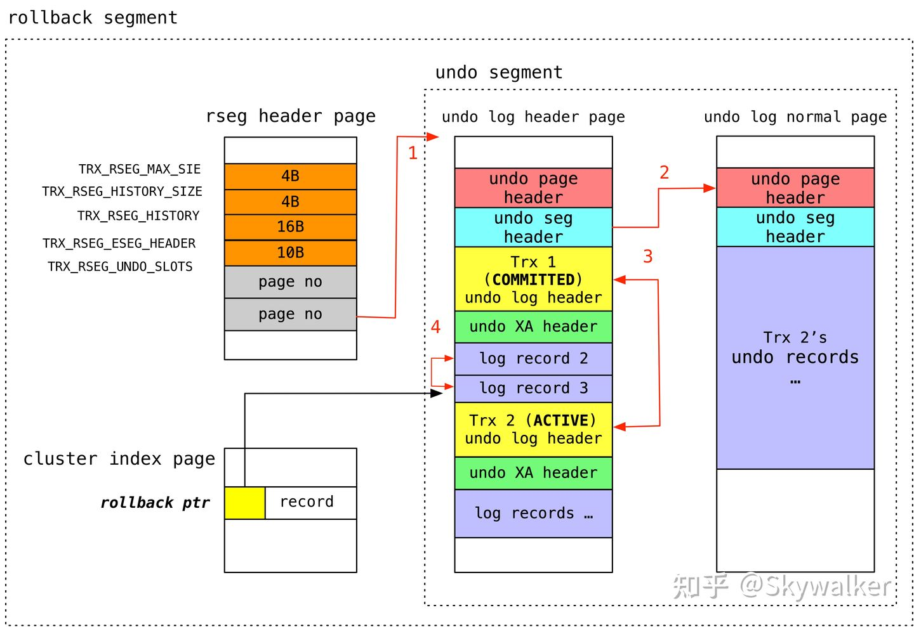

#### 2. 回滚段与事务

1. 每个事务只会使用一个`回滚段（rollback segment）`，一个回滚段在同一时刻可能会服务于多个事务。

2. 当一个事务开始的时候，会制定一个回滚段，在事务进行的过程中，当数据被修改时，原始的数
   据会被复制到回滚段。

3. 在回滚段中，事务会不断填充盘区，直到事务结束或所有的空间被用完。如果当前的盘区不够用，事务会在段中请求扩展下一个盘区，如果所有已分配的盘区都被用完，事务会覆盖最初的盘区或者在回滚段允许的情况下扩展新的盘区来使用。

4. 回滚段存在于undo表空间中，在数据库中可以存在多个undo表空间，但同一时刻只能使用一个undo表空间。

   ```sql
   mysql> show variables like 'innodb_undo_tablespaces';
   +-------------------------+-------+
   | Variable_name           | Value |
   +-------------------------+-------+
   | innodb_undo_tablespaces | 2     |
   +-------------------------+-------+
   1 row in set (0.00 sec)
   
   #undo log的数量,最少为2，undo log的truncate操作有purge协调线程发起。在truncate某个undo log表空间的过程中，保证有一个可用的undo log可用。
   
   ```

   

5. 当事务提交时，InnoDB存储引擎会做以下两件事情：

   - 将undo log放入列表中，以供之后的purge操作

     purge: 清除，清洗
   
   - 判断undo log所在的页是否可以重用(低于3/4可以重用)，若可以分配给下个事务使用

**3. 回滚段中的数据分类**

1. `未提交的回滚数据(uncommitted undo information)`：

   该数据所关联的事务并未提交，用于实现读一致性，所以该数据不能被其他事务的数据覆盖。

2. `已经提交但未过期的回滚数据(committed undo information)`：

   该数据关联的事务已经提交，但是仍受到undo retention参数的保持时间的影响。

3. `事务已经提交并过期的数据(expired undo information)`：

   事务已经提交，而且数据保存时间已经超过undo retention参数指定的时间，属于已经过期的数据。当回滚段满了之后，会优先覆盖"事务已经提交并过期的数据"。

事务提交后并不能马上删除undo log及undo log所在的页。这是因为可能还有其他事务需要通过undo log来得到行记录之前的版本。故事务提交时将undo log放入一个链表中，是否可以最终删除undo log及undo log所在页由purge线程来判断。

### 2.4 undo的类型

在InnoDB存储引擎中，undo log分为：

- insert undo log

  insert undo log是指在insert操作中产生的undo log。因为insert操作的记录，只对事务本身可见，对其他事务不可见(这是事务隔离性的要求)，故该undo log可以在事务提交后直接删除。不需要进行purge操作。

- update undo log

  update undo log记录的是对delete和update操作产生的undo log。该undo log可能需要提供MVCC机制，因此**不能**在事务**提交时就进行删除**。提交时放入undo log链表，等待purge线程进行最后的删除。

### 2.5 undo log的生命周期

#### 1. 简要生成过程

以下是undo+redo事务的简化过程

假设有2个数值，分别为A=1和B=2，然后将A修改为3，B修改为4

```tex
1. start transaction;
2．记录A=1到undo log;
3. update A = 3;
4．记录A=3 到redo log;
5．记录 B=2到undo loq;
6. update B = 4;
7．记录B = 4到redo log;
8．将redo log刷新到磁盘;
9. commit
```

- 在1-8步骤的任意一步系统宕机，事务未提交，该事务就不会对磁盘上的数据做任何影响。
- 如果在8-9之间宕机。
  - redo log 进行恢复
  - undo log 发现有事务没完成进行回滚。
- 若在9之后系统宕机，内存映射中变更的数据还来不及刷回磁盘，那么系统恢复之后，可以根据redo log把数据刷回磁盘。


**只有Buffer Pool的流程：**  

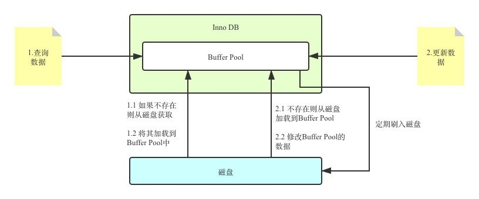


**有了Redo Log和Undo Log之后 :** 

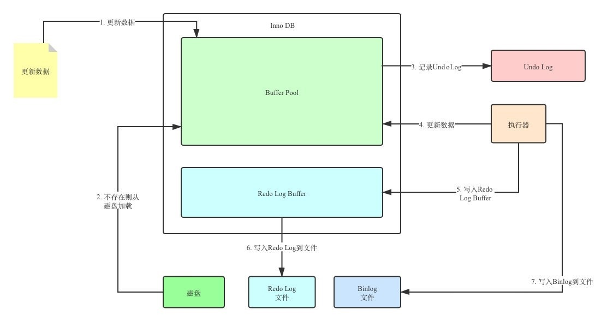

在更新Buffer Pool中的数据之前，我们需要先将该数据事务开始之前的状态写入Undo Log中。假设更新到一半出错了，我们就可以通过Undo Log来回滚到事务开始前。


#### 2. 详细生成过程  

对于InnoDB引擎来说，每个行记录除了记录本身的数据之外，还有几个隐藏的列:

- `DB_ROW_ID`: 如果没有为表显式的定义主键，并且表中也没有定义唯一索引，那么InnoDB会自动为表添加一个row_id的隐藏列作为主键。

- `DB_TRX_ID`︰每个事务都会分配一个事务ID，当对某条记录发生变更时，就会将这个事务的事务ID写入trx_id中。

  > 疑问， 就一个字段，如果有两个事务怎么办。两个事务会不会有锁呢？

- `DB_ROLL_PTR`:回滚指针，本质上就是指向undo log的指针。


**当我们执行INSERT时：**  


 ```sql
begin;
INSERT INTO user (name) VALUES ("tom");
```

插入的数据都会生成一条insert undo log，并且数据的回滚指针会指向它。undo log会记录undo log的序号、插入主键的列和值...，那么在进行rollback的时候，通过主键直接把对应的数据删除即可。

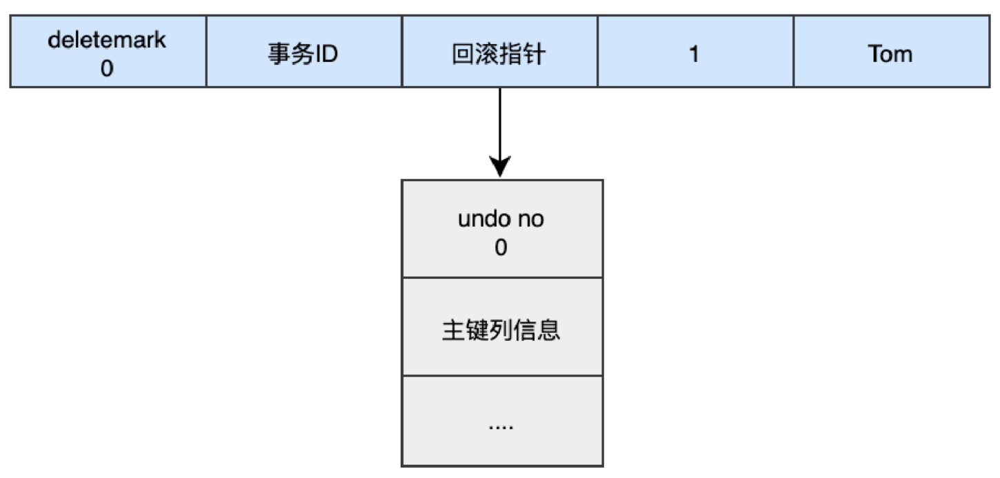

**当我们执行UPDATE时：**  

对于更新的操作会产生update undo log，并且会分更新主键的和不更新主键的，假设现在执行:

 ```sql
UPDATE user SET name= "Sun" WHERE id=1;
```


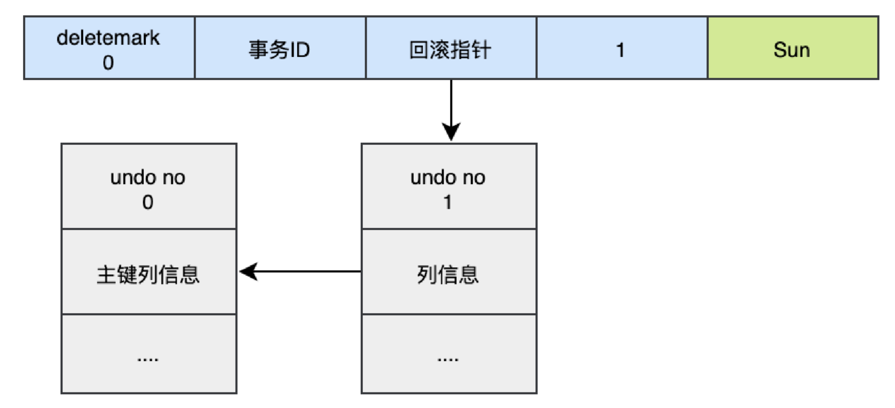


这时会把老的记录写入新的undo log，让回滚指针指向新的undo log，它的undo no是1，并且新的undo log会指向老的undo log (undo no=0)。

假设现在执行:

 ```sql
UPDATE user SET id=2 WHERE id=1;  
```


对于更新主键的操作，会先把原来的数据deletemark标识打开，这时并没有真正的删除数据，真正的删除会交给清理线程去判断，然后在后面插入一条新的数据，新的数据也会产生undo log，并且undo log的序号会递增。

可以发现每次对数据的变更都会产生一个undo log，当一条记录被变更多次时，那么就会产生多条undo log,undo log记录的是变更前的日志，并且每个undo log的序号是递增的，那么当要回滚的时候，按照序号`依次向前推`，就可以找到我们的原始数据了。

#### 3. undo log是如何回滚的

以上面的例子来说，假设执行rollback，那么对应的流程应该是这样：

1. 通过undo no=3的日志把id=2的数据删除
2. 通过undo no=2的日志把id=1的数据的deletemark还原成0
3. 通过undo no=1的日志把id=1的数据的name还原成Tom
4. 通过undo no=0的日志把id=1的数据删除

**4.undo log的删除**

- 针对于insert undo log

  因为insert操作的记录，只对事务本身可见，对其他事务不可见。故该undo log可以在事务提交后直接删除，不需要进行purge操作。

- 针对于update undo log

  该undo log可能需要提供MVCC机制，因此不能在事务提交时就进行删除。提交时放入undo log链表，等待purge线程进行最后的删除。


> 补充:
>
> purge线程两个主要作用是:`清理undo页`和`清除page里面带有Delete_Bit标识的数据`行。仕InnoDB中，事分中的Delete操作实际上并不是真正的删除掉数据行，而是一种Delete Mark操作，在记录上标识Delete_Bit，而
> 不删除记录。是一种"假删除"只是做了个标记，真正的删除工作需要后台purge线程去完成。

## 2.6 小结  


undo log是逻辑日志，对事务回滚时，只是将数据库逻辑地恢复到原来的样子。

redo log是物理日志，记录的是数据页的物理变化，undo log不是redo log的逆过程。  
